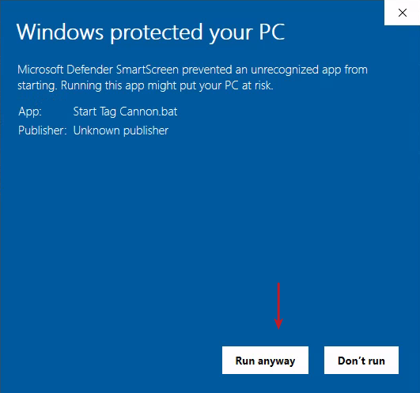

# tag-cannon
Deploy Tanium custom tags with a simple PowerShell UI

# Introduction

Tag Cannon is a tool for formatting a list of computer hostnames into a regex pattern for use on the Tanium platform. This script can also deploy Tanium custom tags to a list of endpoints using the Tanium API.

  

# Starting The Script

A BAT file is included with the PowerShell script to enable starting with a double click. Because this script was downloaded from the internet and is not signed, Windows will display a security warning. Click “More info” then “Run anyway”

  

  

A console window will prompt you to accept the EULA. Press Enter to accept, and then the GUI will open.

# Configuration

## Tanium Server URL

Enter the HTTPS address for your Tanium instance. You must add “-API” to the instance domain if you use a cloud instance. The script will automatically append this if you forget. For example, chuco.cloud.tanium.com becomes chuco-api.cloud.tanium.com. If you have an on-prem instance, use the same URL that is used to log into the console. When you click out of the input box, the script will validate the entered URL.

## Tanium Token

Enter the Tanium token in this box that authorizes you to create actions using the Custom Tags - Add package. The token can be made under the Administration > API Token section.

## Tags to Apply

Enter one or more tags to apply to systems. If multiple tags are entered, they will be split by the space character. An action will be created for each tag entered. Only spaces will be recognized as tag separators.

## Host Platforms

There are two Tanium packages to apply custom tags to devices. When selecting Windows only the package “Custom Tagging - Add Tags” will be used. When Non-Windows is selected the package “Custom Tagging - Add Tags (Non-Windows)” will be used. If you choose “Both”, the script will create separate actions for each package. The script will not automatically split the systems into the proper packages but will use action groups to prevent systems from running the wrong package.

## Recurring Actions

To accommodate systems that might be offline during tag deployments, recurring actions are enabled by default. The created action will recur at the interval you specify under “Reissue Every”. As a general guideline for a 24x7 environment, every 3 hours works well. The “Custom Tag Exists” sensor prevents the systems from running the tagging action multiple times.

  

The “End After” section defines when the tag actions will stop. From the values placed here, the script will take the current time and add your values to define the stop date and time for the scheduled actions. The script does not need to be running at the time of the stop, as this value is configured during action creation..

## Save Configuration

Having this box checked when clicking the Deploy Tags button will save all of the current configuration inputs to disk in cannon.config next to the script file. The token will be encrypted using the Windows Data Protection API.

  

# Input Map

# 

1.  Tanium Server URL: API URL for your Tanium instance.

3.  Tanium Token: A Tanium token that can create actions using the custom tags package.
    
4.  Tags to Apply: A list of tags to apply to systems separated by spaces.
    
5.  Host Platforms: Select the type of hosts that will be targeted.
    
6.  Recurring Action: Set the tagging action to occur multiple times.
    
7.  Reissue Every Number: How many of the selected type will the tagging actions reissue.
    
8.  Reissue Every Type: The time increment used to reissue the action.
    
9.  End After Number: How many of the selected type before the action will stop.
    
10.  End After Type: The time increment that will be used to set an end date for actions being reissued.
    
11.  Save Configuration: Save the current configurations to disk when clicking Deploy Tags.
    
12.  Deploy Tags: Will create actions for tags targeting entered hosts.
    
13.  Status: The script's steps will be logged here
    
14.  Last Action URL: A clickable URL to view the action statuses will be shown here when an action is created.
    
15.  Hostnames box: This UI area deals with hostnames
    
16.  Unformatted Tab: Enter hostnames to format into a regex string. The hosts will also be targeted when the Deploy Tags button is clicked.
    
17.  Formatted Tab: Regex formatted string of hostnames entered in the unformatted tab.
    
18.  Format Only: This button will format the entered list of hostnames to a regex string.
    
19.  Count: The number of hosts contained in the regex string.
